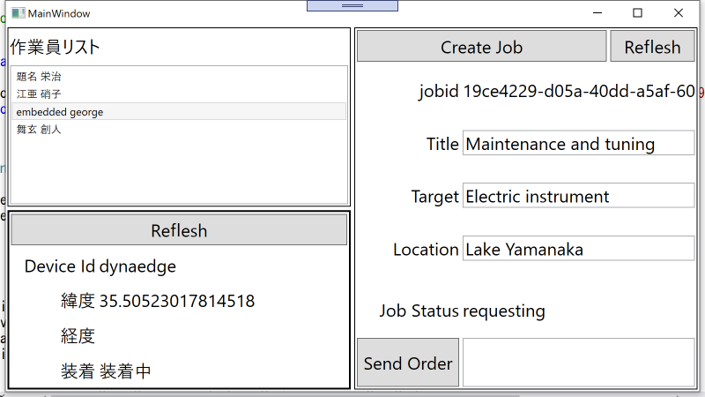
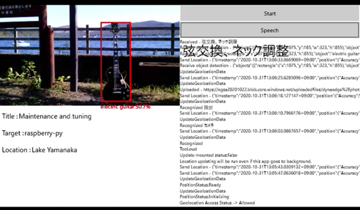
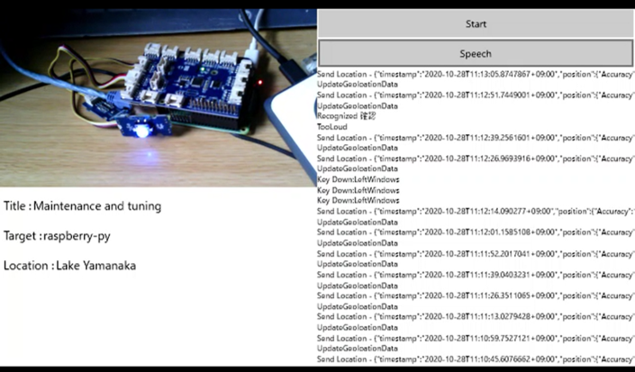

# dynaEdge AR Glass を使った、作業支援コンセプチュアルデモサンプル  

本サンプルは、dynaEdge AR Glass を保守作業業務等で使う場合の、IoT関連サービスを使った作業支援に関して、一部を実装した、コンセプチュアルなサンプルである。  

- 作業ジョブ管理
- 画像と AI を活用した作業支援 
- IoT 対応デバイスとのコラボレーション

等の機能を実装している。

本サンプルを実際に試すには、[dynaEdge AR Glass](https://dynabook.com/business/mecd/product/ar100-jan-2018/index.html)と、Azure Subscription([無料お試しでも可](https://azure.microsoft.com/ja-jp/free/)) 、及び、アプリ開発用 Windows 10 PCが必要である。  

セットアップは、以下に示す順序で行う。  
1. Azure IoT Hub の作成  
[「Azure Portal を使用して IoT Hub を作成する」](https://docs.microsoft.com/ja-jp/azure/iot-hub/iot-hub-create-through-portal)を参考に Azure IoT Hub を一つ作成する
1. [dynaEdge上で動くアプリの設定](./UWPIoTAIApp)
1. [Stream Analyticsの設定](./services/StreamAnalytics)
1. [ジョブ通知用 サーバーレスロジックの設定](./services/JobNotification)
1. [別のPC上でジョブを管理するデスクトップアプリの設定](./WpfAppJobTracking)
1. [物体検知用 サーバーレスロジックの設定](./services/ObjectDetection)
1. [IoT対応デバイス連携用 サーバーレスロジックの設定](./services/CollaborateWithIoTDevice)

---
## 参考画面  

### Job 管理アプリ  

### 作業対象認識  

### IoT デバイス連携  
