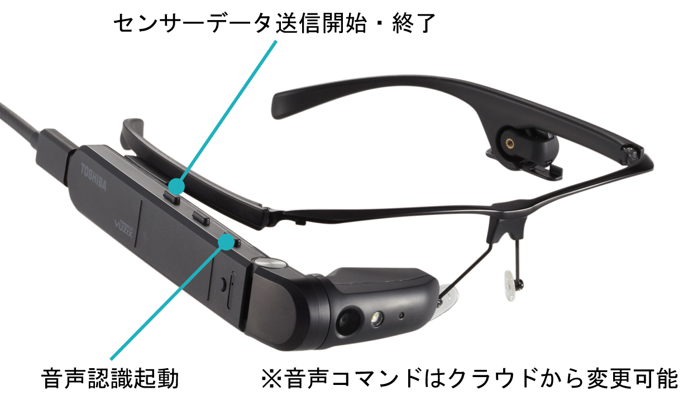

# dynaEdge 上で動作する、画像、音声、センサー、位置情報を使った作業支援を想定したコンセプトアプリサンプル 
Universal Windows Application 形式で動作する IoT コンセプチュアル デモアプリサンプルである。  
IoT Hub や関連サービスと連動して動作する。  

dynaEdge 上での本アプリ実行は、開発用の Windows 10 PC を一台用意して、その PC から、UWPIoTAIApp.sln を Visual Studio 2019 で開き、リモート実行すると便利である。  
詳しくは、[「リモート マシンの UWP アプリを Visual Studio からデバッグする」](https://docs.microsoft.com/ja-jp/visualstudio/debugger/run-windows-store-apps-on-a-remote-machine?view=vs-2019)を参照の事。 

## How To
実行にあたっては、まず、Azure IoT Hub の 'IoT デバイス'にデバイスを適当な名前で登録し、そのデバイスの接続文字列を、[MainPage.xaml.cs](./MainPage.xaml.cs) の、MainPage_Loaded メソッドの直前の、
```c#
        private string iothubCS = "<- IoT Hub Device Connection String ->";

        private async void MainPage_Loaded(object sender, RoutedEventArgs e)
        {
            Windows.UI.ViewManagement.ApplicationView.GetForCurrentView().TryEnterFullScreenMode();
```
'iothubCS' に設定する。
本アプリ実行前に、IoT Hub に登録したデバイスの Device Twins の、properties の直前に、 
```json
  "tags": {
    "application": "dynaedge",
    "personincharge": "題名 栄治"
  },
  "properties": {
    "desired": {
```
のように、'tags'という項目を追加し、'personincharge'に担当者を追加すること。'application'も追加しておくこと。  

[「IoT Hub への Azure Storage アカウントの関連付け」](https://docs.microsoft.com/ja-jp/azure/iot-hub/iot-hub-csharp-csharp-file-upload#associate-an-azure-storage-account-to-iot-hub) を参考にして、Azure Storage Account を一つ作成し、IoT Hub の'メッセージ'->'ファイルのアップロード'で、IoT Hub に Blob Storage を関連付ける。  

### クラウドサービスとの連携のための設定  
ジョブ管理との連携のために、
- [Stream Analytics](../services/StreamAnalytics) を参照して必要な設定を行う  
- [JobNotification](../services/JobNotification) を参照して、Job通知用の Functions を設定する
- [WpfAppJobTracking](../WpfAppJobTracking) を参照して必要な設定を行う  
以上で、Job 管理の機能が使えるようになる。

次に、画像認識サービスとの連携のために、  
- [ObjectDetection](../services/ObjectDetection) を参考に、画像認識用の Functions を設定する  
以上で、画像認識関連の機能が使えるようになる。  

次に、IoT デバイスとの連携のために、  
- [CollaborateWithIoTDevice](../service/CollaborateWithIoTDevice) を参照して必要な設定を行う。  
以上で、IoT デバイスとの連携が可能になる。  


以上、必要な設定を行い、本プロジェクトを VS2019で実行すれば、dynaEdge 上でのリモートデバッグが可能になる。

音声認識の起動や、センサー計測情報送信は、dynaEdge AR Glass のボタンで操作可能である。  
