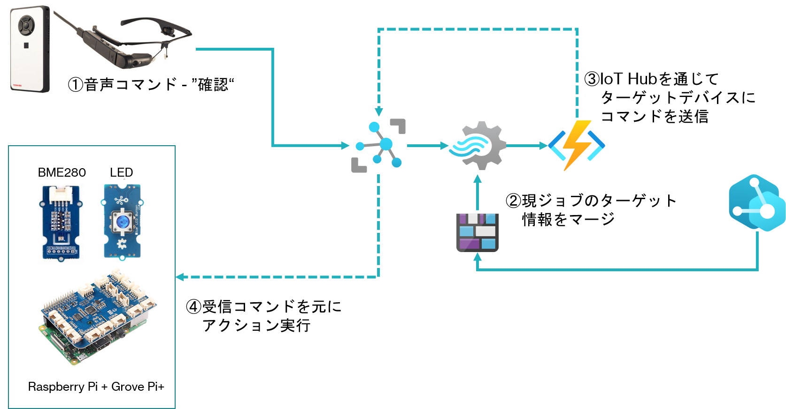

# 保守対象が IoT デバイスの場合に、IoT Hub を通じて Direct Method を起動するサンプル  
[Stream Analytics の説明](../StreamAnalytics) の、'target' 出力からメッセージが、'dynaedgecommnad' Event Hub に送信されたときに起動される Function。  
指定されたデバイス、もしくはモジュールの Direct Method を指定されたパラメータで起動する。  
## How To 
### ローカルテスト実行 
VS Codeを使って開発用PC上でローカル実行・デバッグが可能である。
'[local.settings.json](./local.settings.json)'の各項目にそれぞれの接続文字列をコピペして保存し、
- AzureWebJobsStorage　-> Stream Analytics で使った Blob Storage と同じ Storage Account の接続文字列
- trigger_EVENTHUB -> Stream Analytics の出力 'target' に割り当てた Event Hub の、'listen'ポリシーの接続文字列

- IoTHubConnectionString -> ターゲットデバイスが登録された IoT Hub のサービスロールの接続文字列

### Azure への発行
VS Code で、このフォルダーを開き、[「Publish the project to Azure」](https://docs.microsoft.com/ja-jp/azure/azure-functions/create-first-function-vs-code-csharp#publish-the-project-to-azure)を参考に、Azure にロジックを公開する。
Azure Portal で公開した Function を開き、'構成'->'アプリケーション設定' で、
上述した、local.settings.json の 'AzureWebJobsStorage'、'trigger_EVENTHUB' を '+新しいアプリケーション設定' で追加する。'IoTHubConnectionString'は、'接続文字列'のパートに、'種類'を'Custom'で登録する。  

後は、Stream Analytics Jobを実行して、dynaEdge で操作を行えば、この Function のロジックが実行し、ターゲットの IoT デバイスの Direct Method が起動される。  

最後に、全体の流れを図示する。  
