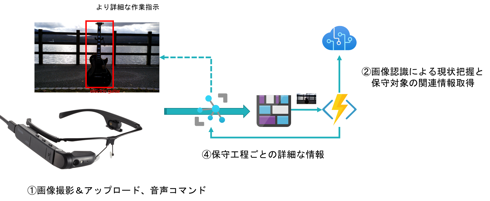

# dynaEdge からアップロードされた画像を認識し、ターゲット情報を追加して、dynaEdge に返信する  
dynaEdge 上で動いている [UWPIoTAIApp](../../UWPIoTAIApp) が、ユーザーの'カメラ'->'撮影'という一連のボイスコマンドで、画像の撮影が行われ、Azure の Blob Storage にアップロードされるのをトリガーに実行される。  
Computer Vision で画像に何が写っているか、どこに写っているか認識し、その情報をUWPIoTApp に転送する。エレキギターが写っていれば、作業用の付帯情報が追加で通知される。  

## How To  

### Computer Vision の作成  
[「COmputer Vision リソースを作成する」](https://docs.microsoft.com/ja-jp/azure/cognitive-services/computer-vision/tutorials/storage-lab-tutorial#create-a-computer-vision-resource) を参考に、各自の Computer Vision を作成する。  

### ローカルテスト実行 
VS Codeを使って開発用PC上でローカル実行・デバッグが可能である。
'[local.settings.json](./local.settings.json)'の各項目にそれぞれの接続文字列をコピペして保存し、
- AzureWebJobsStorage　-> Stream Analytics で使った Blob Storage と同じ Storage Account の接続文字列
- trigger_STORAGE -> IoT Hub の'ファイルのアップロード'にバインドされた Storage Account の接続文字列
- ComputerVisionKey、ComputerVisionEndpoint -> 作成した Computer Vision の該当する項目
- IoTHubConnectionString -> ターゲットデバイスが登録された IoT Hub のサービスロールの接続文字列

### Azure への発行
VS Code で、このフォルダーを開き、[「Publish the project to Azure」](https://docs.microsoft.com/ja-jp/azure/azure-functions/create-first-function-vs-code-csharp#publish-the-project-to-azure)を参考に、Azure にロジックを公開する。
Azure Portal で公開した Function を開き、'構成'->'アプリケーション設定' で、
上述した、local.settings.json の 'AzureWebJobsStorage'、'trigger_STORAGE' を '+新しいアプリケーション設定' で追加する。'ComputerVisionKey'、'ComputerVisionEndpoint'、'IoTHubConnectionString'は、'接続文字列'のパートに、'種類'を'Custom'で登録する。  

後は、dynaEdge で UWPIoTAIApp を起動し、操作を行えば、この Function のロジックが実行し、dynaEdge 上のデスクトップで結果が表示される。 

全体の流れを図示する。  

